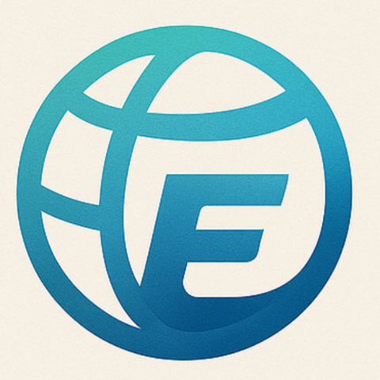
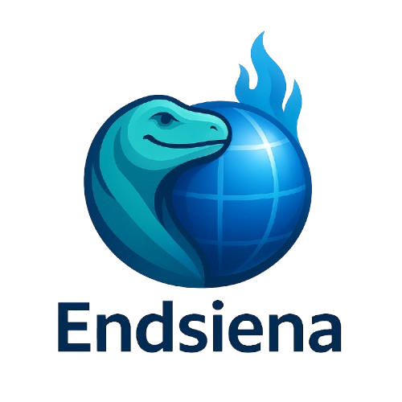
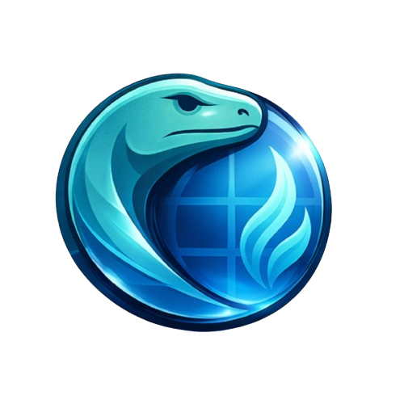

<!-- ========================================================= -->
<!--        EndSiena Browser — Logo Philosophy & Branding       -->
<!-- ========================================================= -->

# 🌀 **EndSiena Browser — Logo Philosophy**

The **EndSiena** logo is more than a visual identity.  
It represents the core values, character, and long-term direction of the EndSiena Browser project.

Every element within the logo is intentionally designed to reflect a browser that is **powerful, secure, efficient, and globally oriented**—a modern system deeply rooted in the history of the web.

 
Main Logo · Alternative · Symbol

---

## 🦎 **The Komodo Dragon — Absolute Strength & Resilience**

The Komodo dragon was chosen as the primary symbol because it is **one of the strongest, most dangerous, and most resilient creatures on Earth**.  
It has survived for millions of years and sits at the top of its ecosystem—symbolizing dominance, adaptation, and extreme endurance.

### **Philosophical Meaning of the Komodo**
- 🛡️ **Strength & protection**  
- 🧬 **Evolution across eras**  
- ☠️ **Natural venom** → a metaphor for hidden yet lethal security systems  
- ⚖️ **Energy efficiency** → never aggressive without purpose  

The Komodo does not attack recklessly.  
It moves with patience, precision, and calculated force—mirroring **EndSiena’s approach**: efficient, stable, intelligent, and system-friendly.

---

## 🎨 **Komodo Color Palette — Light Blue, Teal & Modern Green**

Rather than using natural reptile green, the Komodo is rendered in a **light blue, teal, and modern green gradient**, aligning the identity with digital technology.

### **Color Symbolism**
- 🔵 **Light Blue** → trust, security, stability  
- 🟢 **Teal** → innovation, intelligence, balance  
- 🟢 **Modern Green (Netscape-inspired)** → internet heritage and evolution  

> This palette reinforces EndSiena as a forward-looking browser built upon the legacy of the early web.

---

## 🌍 **The Globe — Digital World & Global Connectivity**

The globe symbolizes the **internet as a borderless digital world**, where information, communication, and culture flow freely.

### **Meaning of the Globe**
- 🌐 **Global connectivity**
- 📡 **Unlimited access to information**
- 🧠 **A living digital ecosystem**

The globe is intentionally designed with a **3D form**, representing depth, complexity, and an immersive browsing experience.

---

## 🔥 **Blue Fire — Rare Energy & Elegant Power**

The Blue Fire concept is inspired by the **Ijen Crater Blue Fire**, a natural phenomenon that is **rare, beautiful, and found in only a few places on Earth**.

### **Blue Fire Philosophy**
- 🔥 **High energy with clean combustion**
- 💎 **Rarity and exclusivity**
- ⚙️ **High performance, fully controlled**
- 🧠 **Intelligence over aggression**

Unlike red fire, which is chaotic and destructive, **blue fire burns hotter, cleaner, and more efficiently**—a direct metaphor for how EndSiena achieves speed through optimization, not brute force.

---

## 🔗 **Unity of Komodo & Globe — Control and Protection**

The Komodo is **integrated with the globe**, not positioned separately.  
This represents EndSiena’s role as both a gateway and a guardian of the digital world.

### **Symbolic Meaning**
- Control of digital navigation  
- Protection during web exploration  
- Stability and user safety  

> EndSiena does not merely open the internet—it safeguards users within it.

---

## 🧩 **No External Flames — Power From Within**

In the final logo direction, external flames are removed to emphasize that **EndSiena’s power resides internally**.

### **Design Implications**
- 🔒 Professional and mature identity  
- ⚙️ System-first philosophy  
- 🧠 Internal efficiency over visual excess  

This approach reflects a browser that does not need to display power—it simply operates with it.

---

## 🏛️ **Logo Philosophy Summary**

| Element | Meaning |
|-------|--------|
| Komodo Dragon | Absolute strength, resilience, security |
| Komodo Venom | Hidden protection mechanisms |
| Blue / Teal Palette | Trust, innovation, stability |
| Globe | Global digital world |
| Blue Fire | Rare, efficient, elegant energy |
| Unified Form | Mature, professional browser |

---

## 🎯 **Closing Brand Statement**

> **The EndSiena logo represents a modern browser that is powerful, secure, and efficient. Inspired by the Komodo dragon—one of the most formidable creatures on Earth—combined with the globe as a symbol of global digital connectivity, and the philosophy of Blue Fire as rare, clean, and intelligent energy. The result is a mature, thoughtful, and future-ready browser identity designed to stand confidently in the modern web era.**

---

© EndSiena Project  
All branding, symbols, and visual identities are part of the EndSiena intellectual property.
